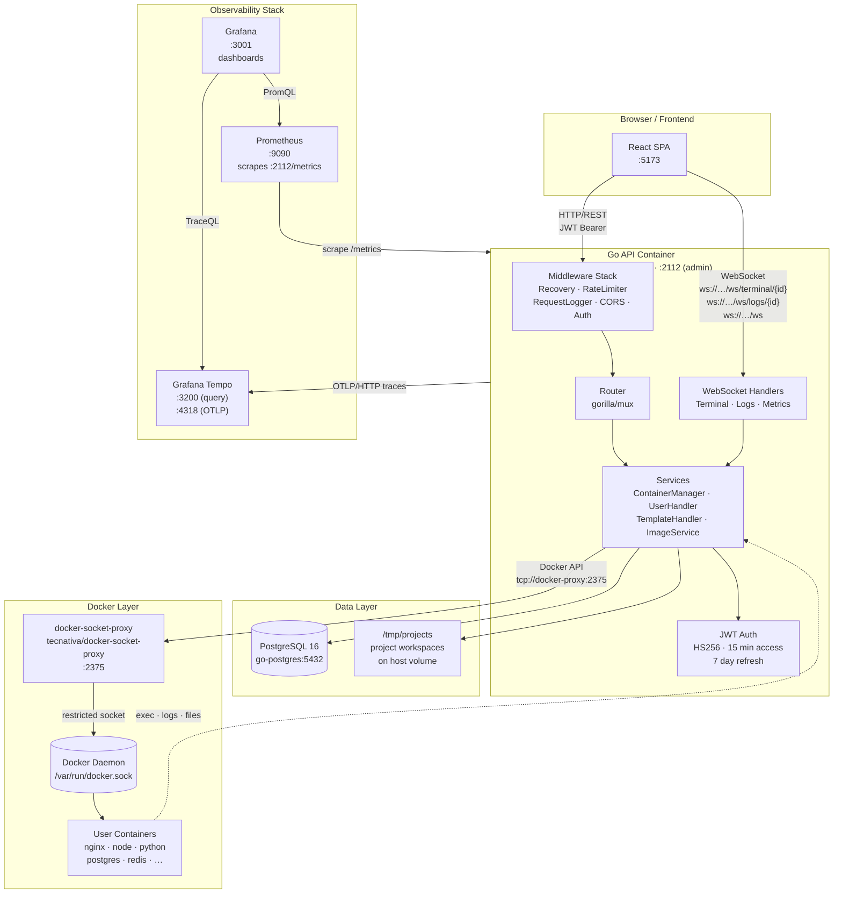

# Docker Wrapper — Backend API

A secure, production-ready REST API for managing Docker containers through a multi-user web interface. Users can spin up pre-defined container environments, interact with them via a browser-based terminal, stream logs in real time, and edit files directly — all without direct access to the Docker daemon.

---

## Architecture



---

## Features

- **Multi-user authentication** — register, login, JWT access/refresh token pair
- **Predefined templates** — users pick from 10 curated images; arbitrary image names are rejected
- **Full container lifecycle** — create, start, stop, remove containers per user
- **Browser terminal** — WebSocket-backed PTY session via `docker exec`
- **Live log streaming** — tail container logs over WebSocket
- **Real-time metrics** — CPU/memory/network stats pushed over WebSocket
- **File explorer** — browse workspace directory tree inside a container
- **File editor** — read and write files directly inside a running container
- **Auto-stop** — idle containers stopped automatically after a configurable timeout
- **Audit log** — every mutating action recorded with user, IP, and metadata
- **Observability** — Prometheus metrics, OpenTelemetry traces (Tempo), Grafana dashboards
- **Security** — Docker socket access restricted via docker-socket-proxy; rate limiting per IP; non-root container image

---

## Tech Stack

| Layer | Technology |
|---|---|
| Language | Go 1.25 |
| HTTP router | gorilla/mux |
| WebSocket | gorilla/websocket |
| Database driver | pgx/v5 (pgxpool) |
| Migrations | golang-migrate/migrate v4 |
| Auth | golang-jwt/jwt v5, bcrypt |
| Docker client | docker/docker (Moby SDK) |
| Metrics | prometheus/client_golang |
| Tracing | OpenTelemetry OTLP/HTTP → Grafana Tempo |
| Container image | Alpine 3.21 (multi-stage build) |
| Database | PostgreSQL 16 |
| Observability | Prometheus · Grafana Tempo · Grafana |
| Docker security | tecnativa/docker-socket-proxy |

---

## Getting Started

### Prerequisites

- Docker Engine 24+ and Docker Compose v2
- `make` (optional, for shortcuts)

### 1. Clone and configure

```bash
git clone https://github.com/dahhou-ilyas/host-container.git
cd host-container
cp .env.example .env
```

Edit `.env` and set at minimum:

```dotenv
JWT_SECRET_KEY=<at-least-32-random-characters>
GRAFANA_ADMIN_PASSWORD=<your-password>
```

### 2. Start all services

```bash
docker compose up --build
```

This starts: **api**, **postgres**, **docker-proxy**, **prometheus**, **tempo**, **grafana**.

Migrations run automatically on startup.

### 3. Verify

```bash
curl http://localhost:8080/health
# {"status":"ok"}

curl http://localhost:2112/healthz
# {"status":"ok"}
```

---

## Environment Variables

| Variable | Default | Description |
|---|---|---|
| `APP_ADDR` | `:8080` | Main API listen address |
| `ADMIN_ADDR` | `:2112` | Admin/metrics listen address |
| `DATABASE_URL` | — | PostgreSQL DSN (required) |
| `JWT_SECRET_KEY` | — | HS256 signing key, min 32 chars (required) |
| `PROJECTS_BASE_PATH` | `/tmp/projects` | Host path for container workspaces |
| `CONTAINER_AUTO_STOP_TIMEOUT` | `30m` | Idle container auto-stop duration |
| `MAX_CONTAINERS_PER_USER` | `10` | Per-user container limit |
| `ALLOWED_ORIGINS` | `http://localhost:5173` | CORS allowed origins (comma-separated) |
| `OTEL_SERVICE_NAME` | `my-go-service` | Service name in traces |
| `OTEL_EXPORTER_OTLP_ENDPOINT` | _(empty = disabled)_ | OTLP collector endpoint |
| `ENABLE_PPROF` | `false` | Expose pprof on admin port |
| `DOCKER_HOST` | _(system default)_ | Docker daemon address |

---

## API Reference

All authenticated routes require `Authorization: Bearer <access_token>`.

### Authentication

| Method | Path | Auth | Description |
|---|---|---|---|
| `POST` | `/auth/register` | No | Create a new user account |
| `POST` | `/auth/login` | No | Obtain access + refresh tokens |
| `POST` | `/auth/refresh` | No | Exchange refresh token for new access token |

### User

| Method | Path | Auth | Description |
|---|---|---|---|
| `GET` | `/user/me` | Yes | Get current user profile |
| `GET` | `/user/containers` | Yes | Get user profile with all containers |
| `DELETE` | `/user` | Yes | Delete current user account |

### Templates

| Method | Path | Auth | Description |
|---|---|---|---|
| `GET` | `/templates` | No | List all templates (filter: `?category=database`) |
| `GET` | `/templates/{id}` | No | Get a single template by ID |

### Containers

| Method | Path | Auth | Description |
|---|---|---|---|
| `POST` | `/containers` | Yes | Create a container from a template |
| `GET` | `/containers/get` | Yes | Get container details |
| `POST` | `/containers/start` | Yes | Start a stopped container |
| `POST` | `/containers/stop` | Yes | Stop a running container |
| `DELETE` | `/containers/remove` | Yes | Remove a container |
| `POST` | `/containers/exec` | Yes | Execute a command inside a container |
| `GET` | `/containers/showTreeFolder` | Yes | Browse the workspace file tree |
| `GET` | `/containers/file/read` | Yes | Read a file from the container workspace |
| `POST` | `/containers/file/write` | Yes | Write a file to the container workspace |

### WebSocket

| Path | Auth | Description |
|---|---|---|
| `/ws/terminal/{project_id}` | Yes | Interactive PTY terminal session |
| `/ws/logs/{project_id}` | Yes | Real-time container log stream |
| `/ws` | Yes | Container resource metrics (CPU, memory, network) |

### Health

| Method | Path | Description |
|---|---|---|
| `GET` | `/health` | Liveness — always returns 200 |
| `GET` | `/healthz` | Admin liveness |
| `GET` | `/readyz` | Admin readiness — checks DB connectivity |
| `GET` | `/metrics` | Prometheus metrics (admin port :2112) |

---

## Database Schema

Six migrations build the schema incrementally:

```
000001  users, containers
000002  containers.started_at
000003  images (legacy seed table)
000004  containers.image_name
000005  audit_log
000006  templates (10 pre-seeded rows)
```

**Key tables:**

```sql
users        (id, name, email, password_hash)
containers   (id, container_id, project_name, folder_path, port, status, user_id, started_at, image_name)
templates    (id, name, description, image, category, tags JSONB, popular, icon, default_ports JSONB)
audit_log    (id UUID, user_id, action, resource, resource_id, ip, user_agent, metadata JSONB, created_at)
```

---

## Pre-defined Templates

| Name | Image | Category |
|---|---|---|
| Nginx | `nginx:alpine` | web |
| Node.js | `node:20-alpine` | runtime |
| Python | `python:3-alpine` | runtime |
| PostgreSQL | `postgres:16` | database |
| Redis | `redis:alpine` | database |
| MySQL | `mysql:8` | database |
| MongoDB | `mongo:7` | database |
| Alpine | `alpine:latest` | tools |
| Ubuntu | `ubuntu:22.04` | tools |
| RabbitMQ | `rabbitmq:alpine` | tools |

Requests to `POST /containers` with an image not in this list are rejected with `400 Bad Request`.

---

## Observability

### Prometheus — `http://localhost:9090`

Metrics scraped from `:2112/metrics` every 15 seconds. Key metrics:

- `http_in_flight_requests` — current in-flight requests
- `http_requests_total{handler, code, method}` — request counter
- `http_request_duration_seconds{handler, code, method}` — latency histogram

### Grafana — `http://localhost:3001`

Login with `admin` / value of `GRAFANA_ADMIN_PASSWORD` in `.env`.

Two datasources are pre-provisioned:
- **Prometheus** — query metrics with PromQL
- **Tempo** — query distributed traces with TraceQL

### Grafana Tempo — traces

The API exports OpenTelemetry traces to `http://tempo:4318` (OTLP/HTTP). Every HTTP handler is automatically instrumented via `otelhttp`. Traces are retained for 24 hours.

Set `OTEL_EXPORTER_OTLP_ENDPOINT=` (empty) to disable tracing entirely with zero overhead.

---

## Project Structure

```
docker-wrapper/
├── main.go                  # Entry point, router setup, OTEL, Prometheus
├── Dockerfile               # Multi-stage build (golang:1.25-alpine → alpine:3.21)
├── docker-compose.yml       # Full stack: api, postgres, proxy, prometheus, tempo, grafana
├── .env.example             # All supported environment variables
├── migrations/              # SQL migrations (golang-migrate)
├── db_config/               # pgxpool initialization and lifecycle
├── service/                 # HTTP handlers (containers, users, templates, images)
├── repository/              # SQL queries (template, audit)
├── websocket/               # WebSocket handlers (terminal, logs, metrics)
├── middlware/               # Recovery, rate limiter, request logger, CORS, auth
├── jwt/                     # Token generation and validation
├── utils/                   # JSON response helpers, file tree parser
└── Docker/                  # Config files for prometheus, tempo, grafana
```

---

## Security Notes

- The Docker socket is **never** mounted directly into the API container. All Docker API calls go through [tecnativa/docker-socket-proxy](https://github.com/Tecnativa/docker-socket-proxy), which exposes only `CONTAINERS`, `IMAGES`, `EXEC`, and `POST` operations.
- The API container runs as a **non-root user** (`appuser`, uid 1001).
- IP-based rate limiting (`10 req/s`, burst 30) is applied globally.
- `ENABLE_PPROF=true` must only be set on internal hosts — it exposes profiling endpoints on the admin port.
- Set a strong `JWT_SECRET_KEY` (≥ 32 characters) and use `sslmode=require` in `DATABASE_URL` for production.

---

## License

MIT
